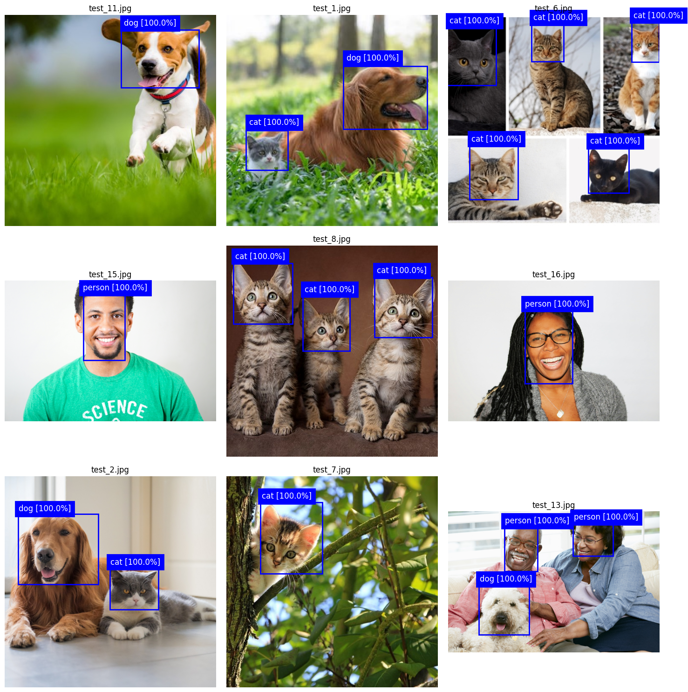
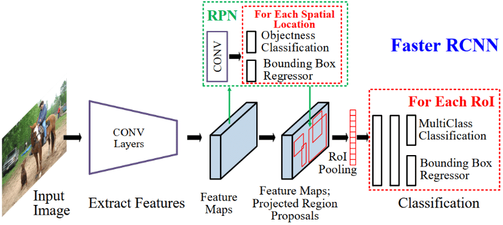
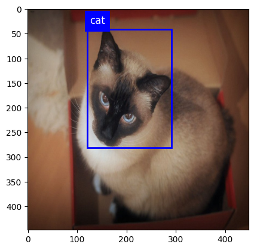
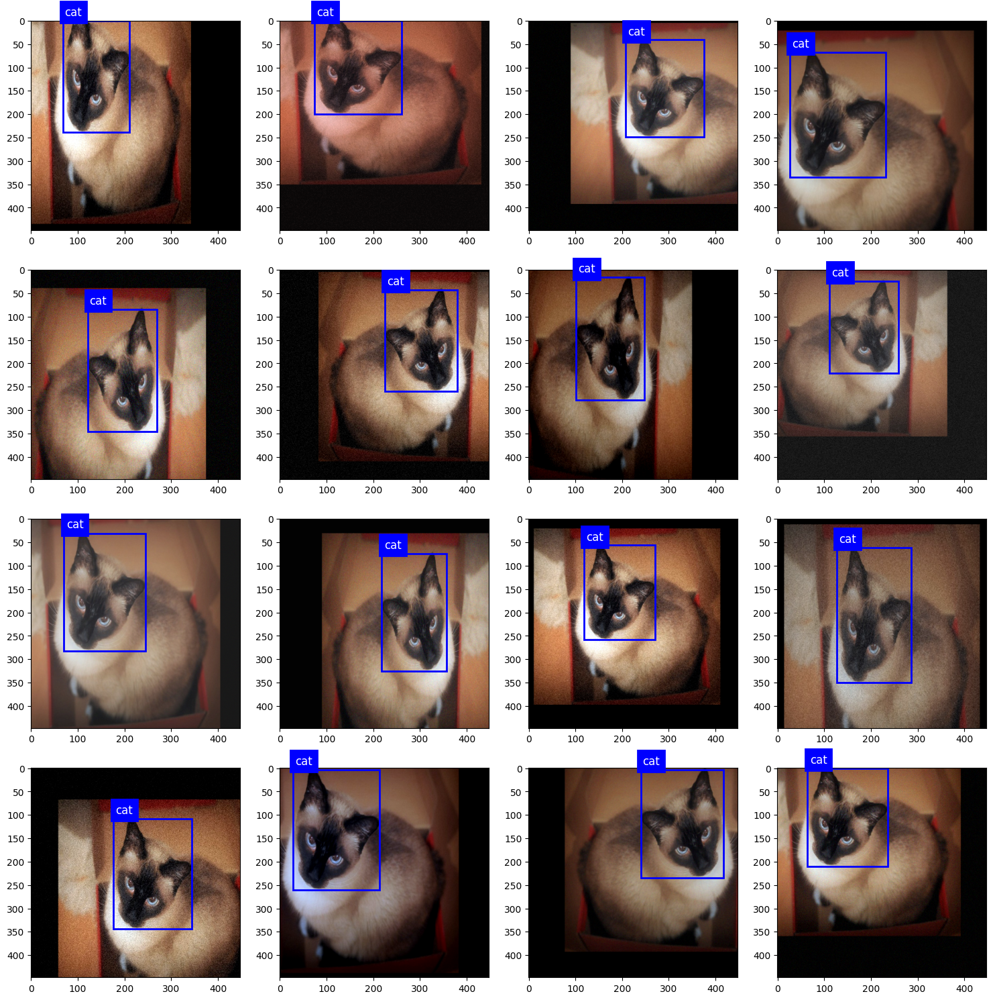
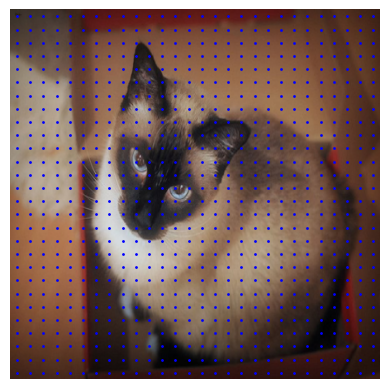
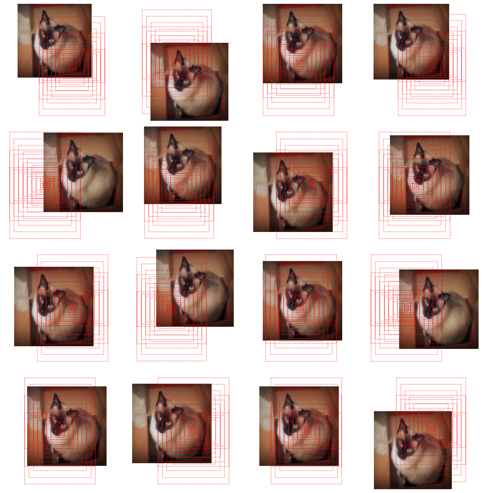
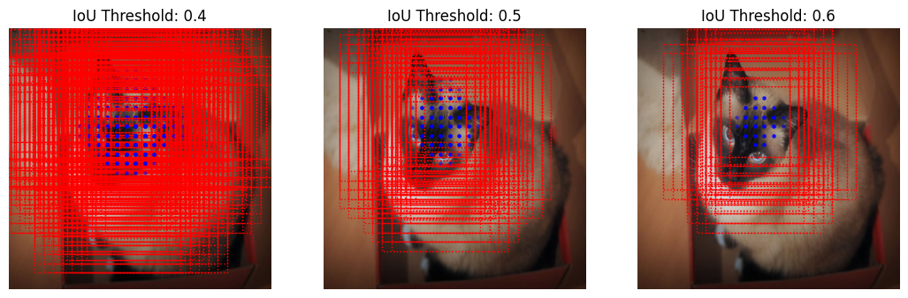
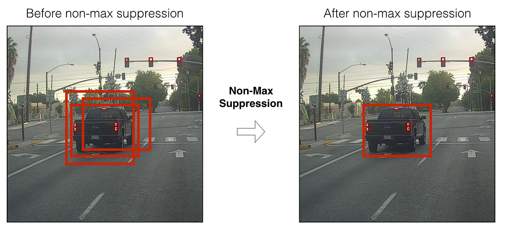

# Object Detection (Faster R-CNN) - [Cats, Dogs & People] 

This Python project aims to provide a custom Tensorflow implementation of the Faster Region-based Convolutional Neural Network (R-CNN) object detection algorithm, which can be easily trained on the provided datasets. In this case, I have trained the model to do object detection on images and videos of cats, dogs, and people. 
The notebook in this project walks you through how the model was trained and how to use the model to do object detection on images and videos.

## Model Performance on Images

## Model Performance on Videos

## The /datasets/ Folder
This project has a /datasets/ folder which contains the datasets that can be used for training the object detection models. Each /datasets/ subdirectory holds a dataset and each dataset folder, in turn, has an /images/ and an /annotations/ folder. The images are naturally stored in the /images/ subdirectory and the annotations are stored in the /annotations/ subdirectory. The annotations have to be in PASCAL VOC XML format.
You can easily add, remove, or replace datasets to adjust the scope of the object detection. 

NOTE that the /datasets/ folder currently only holds an example dataset to clarify the way datasets have to be structured.

## Faster Region-based Convolutional Neural Network (Faster R-CNN)

Faster R-CNN is a so-called one-shot object detector. The first part of the model is aimed at proposing regions within the image that conatin the objects. This is done through what is called a Region Proposal Network (RPN). The second stage is a Convolutional Neural Network (CNN), which can classify these regions of interest (ROIs) into one of several class labels.

image source: https://ashutoshmakone.medium.com/faster-rcnn-502e4a2e1ec6

## Preprocessing

Images that serve as input for the models are resized to the desired input dimensions. Of course, the corresponding annotations with the bounding box coordinates have to be adjusted as well.

    

### Augmentation

Data augmentation helps the model generalize from the training data to 'unseen' test data. Without augmentation, sufficiently sophisticated models can simply "memorize" specific training examples instead of learning how to recognize and locate the objects within the image based on object features. This is called overfitting.

Implementing image augmentation by adjusting the factors for hue, contrast, brightness and saturation are fairly straightforward as they do not involve changing the location of the objects within the image and thus changing the bounding box coordinates for the model target labels. However, introducing random translations will change the location of the objects relative to the resulting image, which makes it a little more involved.

### Overlaying Grid and Anchors

Region Proposal Networks (RPNs), like the ones employed in R-CNN models, use a set of anchors (boxes with a predetermined height and width) that are placed at evenly spaced-out grid locations within the image. It is then determined which of these anchors have a high enough overlap (IoU) with an underlying ground truth object within the image. For these anchors, offsets (regression deltas) are calculated which provide us with the regression targets for the network. 

    
	

### Assigning Anchors to Ground Truth Objects (based on IoU)

Each grid point gets assigned a subset of anchor boxes. These gridpoints and their assigned boxes are put over the image. At which point, we can calculate their Intersection over Union (IoU) with any of the ground truth boxes within the image. If the IoU is high enough, the gridpoint box gets assigned to the underlying ground truth object and a set of offset regression targets is calculated.

As you can clearly see above, the higher the Intersection over Union (IoU) threshold for assigning an anchor to a ground truth object, the lower the number of anchors that meet this threshold and the lower the number of anchors that will end up serving as targets for the network.

When the gridpoint boxes are adjusted by their regression variables, they perfectly correspond with their assigned ground truth bounding box.

## Non-Max Suppression (Post-Processing)

We refine the bounding boxes outputted by the RPN model by applying non-max suppression (NMS). This technique helps us to select the best bounding box when we are dealing with overlapping boxes.

With NMS, we discard bounding boxes with confidence scores lower then a given threshold. The remaining boxes are pruned iteratively by discarding the lower confidence box when deciding between two overlapping bounding boxes (boxes with an IoU over a certain threshold). 

image source: https://towardsdatascience.com/non-maximum-suppression-nms-93ce178e177c

## Final Remarks

### Further Improvements
Evaluating the results of our model, we can clearly see that it has some problems with accurately detecting smaller objects. This is at least in part caused by the distortion that happens when training and test images are resized to model input dimensions. 

I suspect that a combination of more consistent training/test image dimensions, together with upping the resolution, and a more densely populated grid for anchors, would improve model performance.